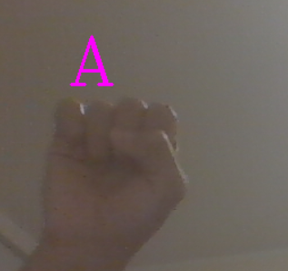
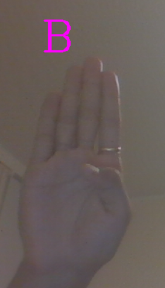
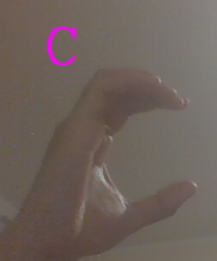

# Hand Gesture Recognition ✋

A beginner computer vision project that detects hand gestures in real time using a webcam and classifies them using a trained TensorFlow model.

## 📌 About the Project

This project uses a webcam to detect a hand and recognize different hand gestures.

Currently, the model is trained to recognize:

- A
- B
- C

The hand is detected using `cvzone` and MediaPipe, while TensorFlow/Keras is used to classify the processed hand image.

## 🛠️ Technologies Used

- Python 3.10
- OpenCV
- cvzone
- MediaPipe
- TensorFlow
- Keras
- NumPy

## 📂 Project Structure

```text
Hand-Gesture-Recognition/
│
├── Model/
│   ├── keras_model.h5
│   └── labels.txt
│
├── screenshots/
│   ├── HandA.png
│   ├── HandB.png
│   └── HandC.png
│
├── dataCollection.py
├── test.py
├── main.py
├── requirements.txt
├── README.md
└── .gitignore
```

## 📸 Screenshots

### Gesture A



### Gesture B



### Gesture C



## ⚙️ Installation

### 1. Clone the repository

```bash
git clone YOUR_GITHUB_REPOSITORY_URL
```

### 2. Navigate to the project directory

```bash
cd Hand-Gesture-Recognition
```

### 3. Create a virtual environment

```bash
python -m venv venv
```

### 4. Activate the virtual environment

**Windows:**

```bash
venv\Scripts\activate
```

### 5. Install the required dependencies

```bash
pip install -r requirements.txt
```

## ▶️ Running the Project

Make sure your webcam is connected and available.

Run:

```bash
python main.py
```

The webcam will open and the program will detect your hand and classify the gesture.

## 🎯 Recognized Gestures

| Gesture | Prediction |
|---------|------------|
| ✋ | A |
| 🤚 | B |
| 👋 | C |

> Note: The actual hand poses depend on the gestures used when training the model.

## 🔄 How It Works

```text
Webcam
   ↓
Hand Detection
   ↓
Hand Bounding Box
   ↓
Crop Hand Image
   ↓
Resize & Preprocess
   ↓
TensorFlow Model
   ↓
Gesture Prediction
```

## 🧠 Model

The project uses a trained TensorFlow/Keras model stored in the `Model` folder.

The model receives the processed hand image and predicts which gesture it represents.

The labels are stored in:

```text
Model/labels.txt
```

and the trained model is stored in:

```text
Model/keras_model.h5
```

## 📚 What I Learned

Through this project, I learned about:

- Real-time computer vision
- Hand detection using MediaPipe
- Using cvzone for computer vision applications
- Image cropping and preprocessing
- Using OpenCV with a webcam
- Loading and using a trained TensorFlow model
- Python virtual environments
- Managing project dependencies
- Using Git and GitHub

## 🚀 Future Improvements

Some improvements I would like to make in the future:

- Add more hand gestures
- Recognize the complete alphabet
- Improve prediction accuracy
- Add gesture-to-text conversion
- Add voice output
- Create a better user interface
- Support multiple hands

## 📦 Requirements

The project was developed and tested using:

```text
Python       3.10.5
TensorFlow   2.10.0
Keras        2.10.0
NumPy        1.23.5
OpenCV       4.8.1.78
cvzone       2.0.0
```

For the complete list of dependencies, see:

```text
requirements.txt
```
